# Lessons and Stories

### v4.2

#### Ben Orenstein, thoughtbot

---

# Let's go!

---

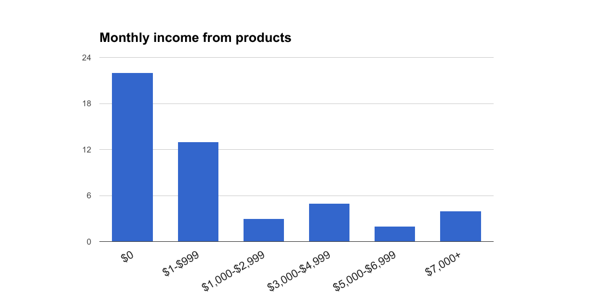

---

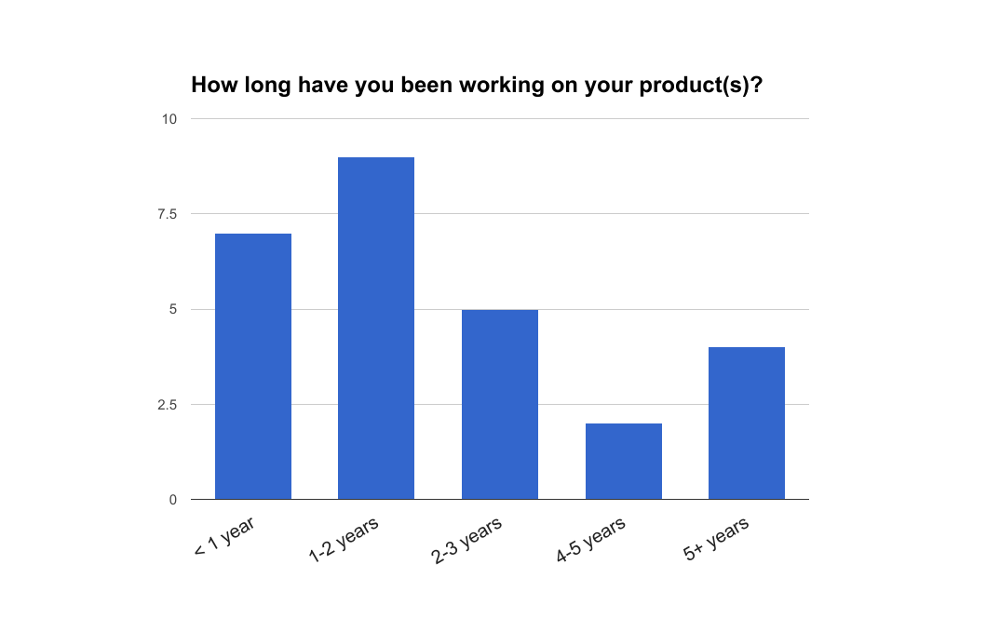

---

# This presents an interesting challenge

---

# Story time

---

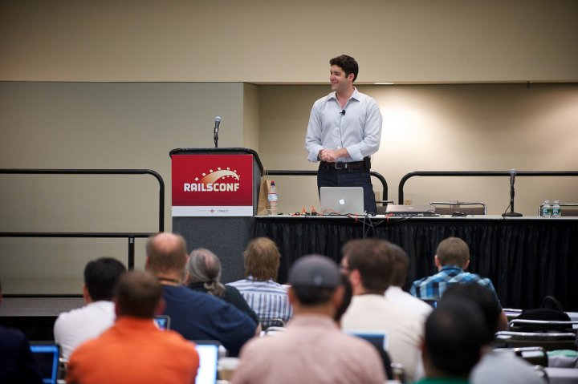

---

---

# How I'd Start Over

## Phase 1: Teach

---

# Three wins in this phase

---

# How I'd Start Over

## Phase 2: Build

---

---

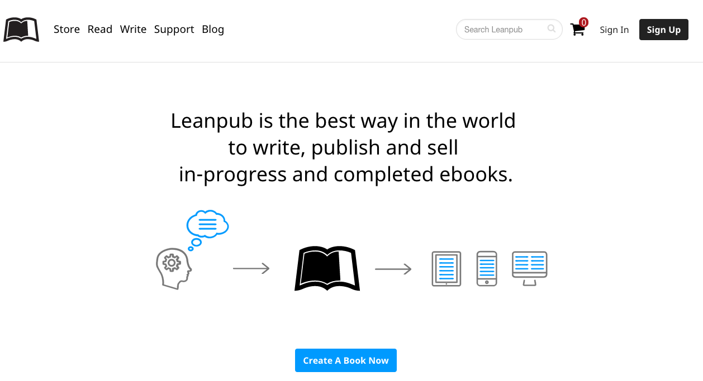

---

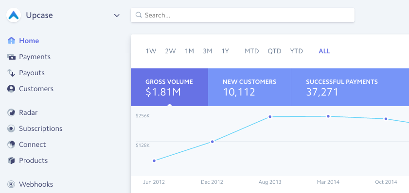

---

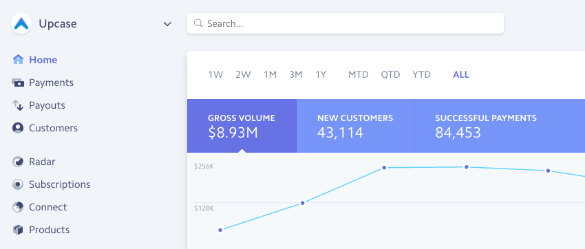

---

# Let's talk about *inspiration*

---

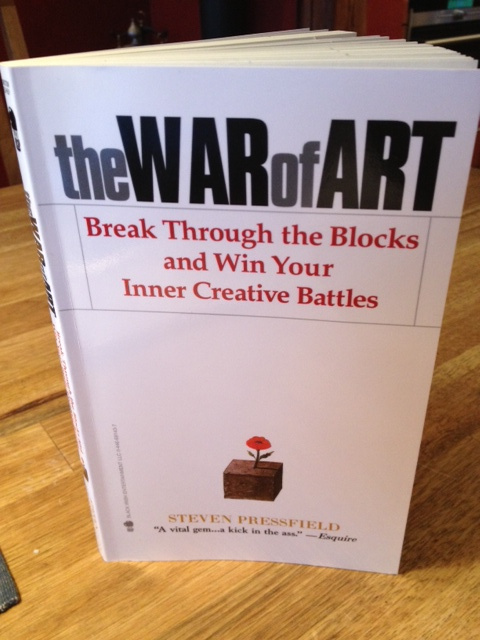

---

# Break time! 

---

# Part 2: Advice for those who have started

---

# If I could *make* you do one thing...

---

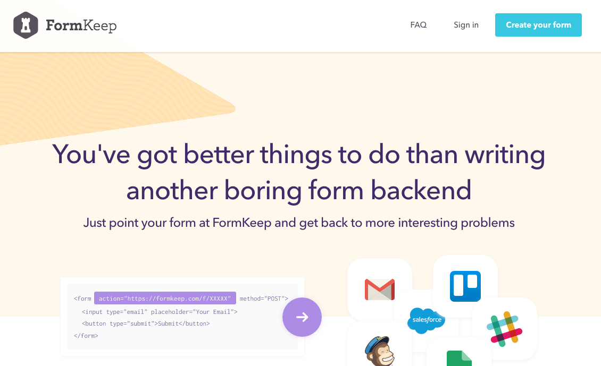

---

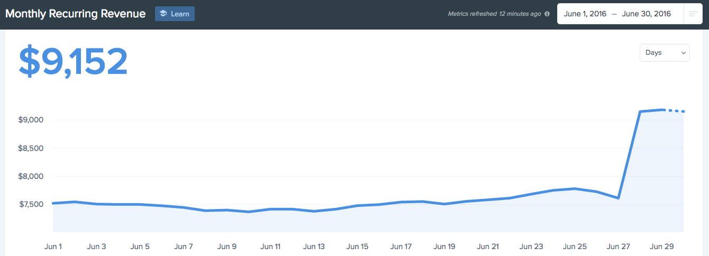

---

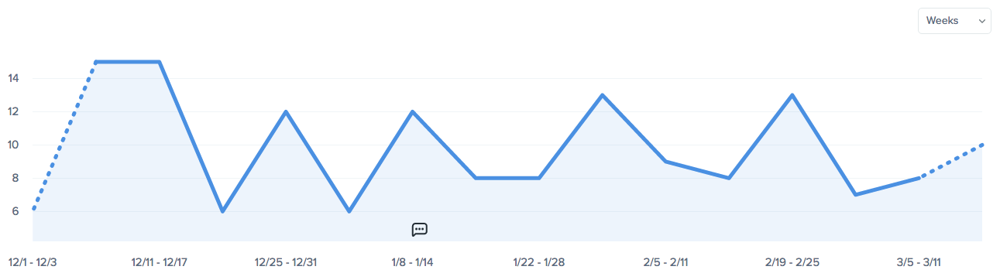

---

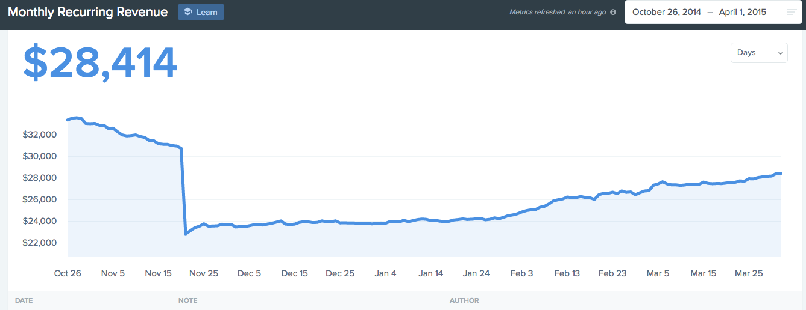

---

# It's *not* just *me*

---

# John Norman, Ghost

## $750k ARR

---

# Tip:   Create a recurring reminder to run a pricing test every 6 months

---

# Summary

---

# Don't be shy

## @r00k

## ben@benorenstein.com
