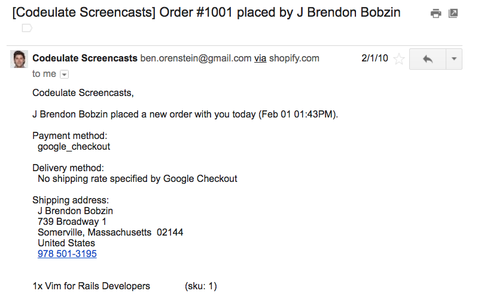

# [fit] Prescriptions  and  Descriptions

### Ben Orenstein, thoughtbot

---

# Let's go!

---

---

# [fit] The plan

## Haven't started: prescriptive

## Lauched already: descriptive

---

# [fit] The payoff

## Haven't started: clear process

## Launched already: my best tactics

---

# How I started

---

---

---

---

# How I'd Start Over

## Phase 1: Teach

---

# How to pick a topic

---

# *How* do you teach it?

---

# Three wins in this phase

---

# Phase 2: Pre-sell an info product

---

# Goal:   sell *one* copy   to *one* stranger

---

# Tip: small is beautiful :)

---

---

---

# *Don't* wait for inspiration

---

---

# Let's get weird

---

# [fit] Part 2: My   Ten   Best Tactics

---

# 1. Create a recurring reminder to run a pricing test every 6 months

---

# Your first test: hide your cheapest plan/tier

---

---

# 2. Create an email course

---

# 3. Integrate and partner

## Look for win/wins

---

# 4. Sell annual plans

---

# 5. Put faces near things you want clicked

---

---

---

# 6. Try a diving save

---

# 7. Start a podcast

---

# 8. Manually onboard customers

---

# 9. Double down on things that work

---

# 10. Ask for help

## @r00k

## ben@benorenstein.com
