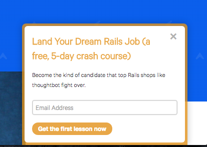
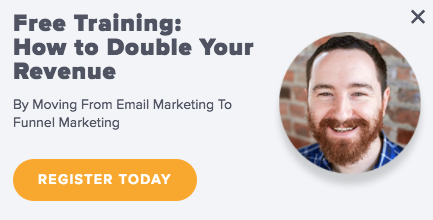

# How I'd start over

### v5.0

#### Ben Orenstein, thoughtbot

---

# Let's go!

---

---

# This presents an interesting challenge

---

# The plan

## Haven't started: narrow

## Lauched already: wide

---

# How I Started

---

---

---

# How I'd Start Over

## Phase 1: Teach

---

# *What* should you teach?

---

# *How* do you teach it?

---

# Three wins in this phase

---

# Phase 2: Pre-sell an info product

---

# Victory at this stage is selling 1 copy to 1 stranger

---

# Tip: small is beautiful

---

---

---

# Classic mistakes at this stage

---

# *Don't* think about replacing your income

---

# *Don't* wait for inspiration

---

---

# Let's get weird

---

# Part 2: Advice for those who've started

---

# 1. Create a recurring reminder to run a pricing test every 6 months

---

# Your first test: hide your cheapest plan/tier

---

---

# In general: don't sell things to businesses for less than $49/month

---

# 2. Create an email course

---

# 3. Integrate and partner

## Look for win/wins

---

# 4. Sell annual plans

---

# 5. Put faces on landing pages

---

---

---

# 6. Try to save churning customers

---

# 7. Start a podcast

---

# 8. Manually onboard customers

---

# 9. Double down on things that work

---

# 10. Ask for help

## @r00k

## ben@benorenstein.com
