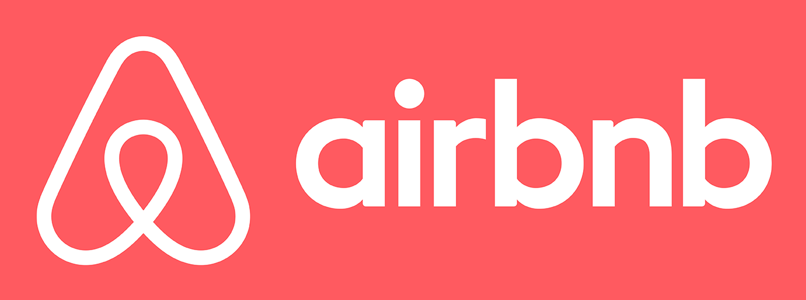

# Lessons and Stories

### v4.2

#### Ben Orenstein, thoughtbot

---

# Let's go!

---

---

---

# Story time

---

---

---

# How I'd Start Over

## Phase 1: Teach

---

# Three wins in this phase

---

# How I'd Start Over

## Phase 2: Build

---

---

---

---

---

# Let's talk about *inspiration*

---

# Coordination test

---

# Advice for those who have started

---

---

---

---

---

# Tip:   Put a recurring event on your calendar to run a pricing test
